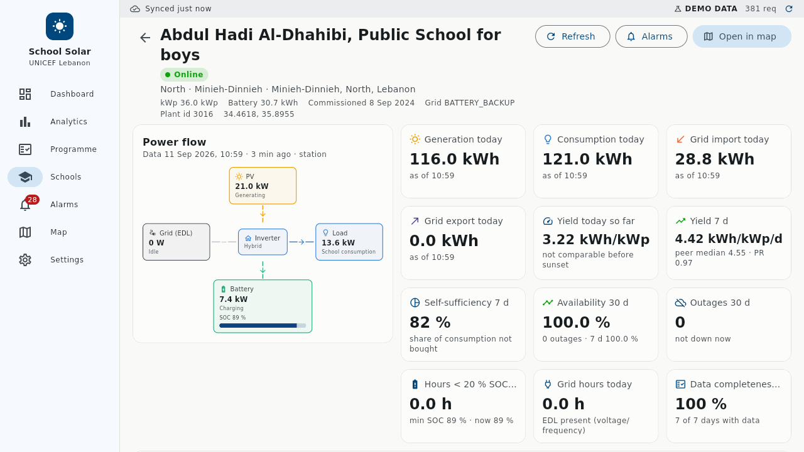
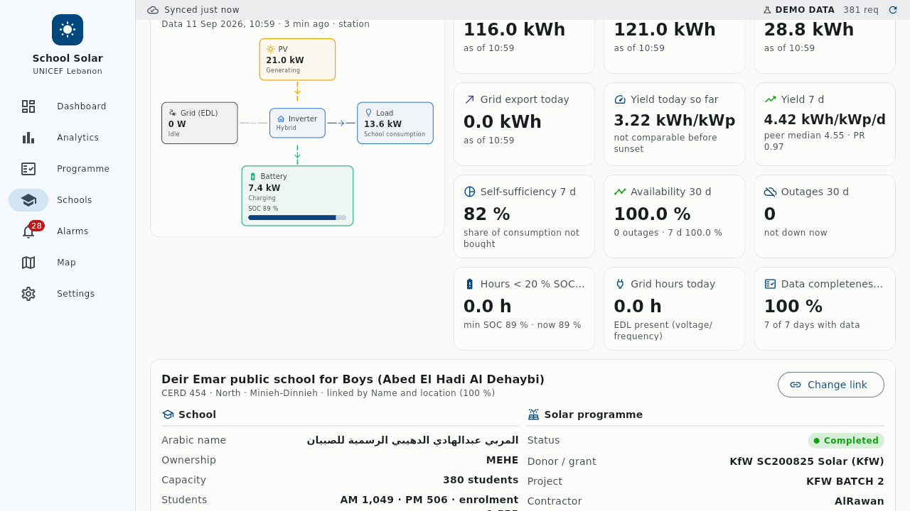
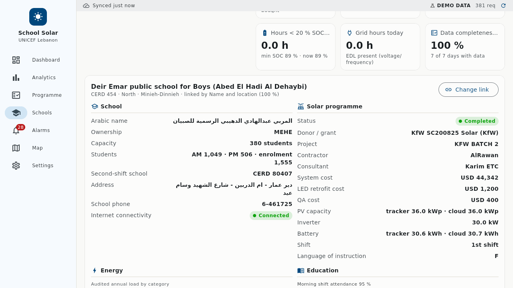
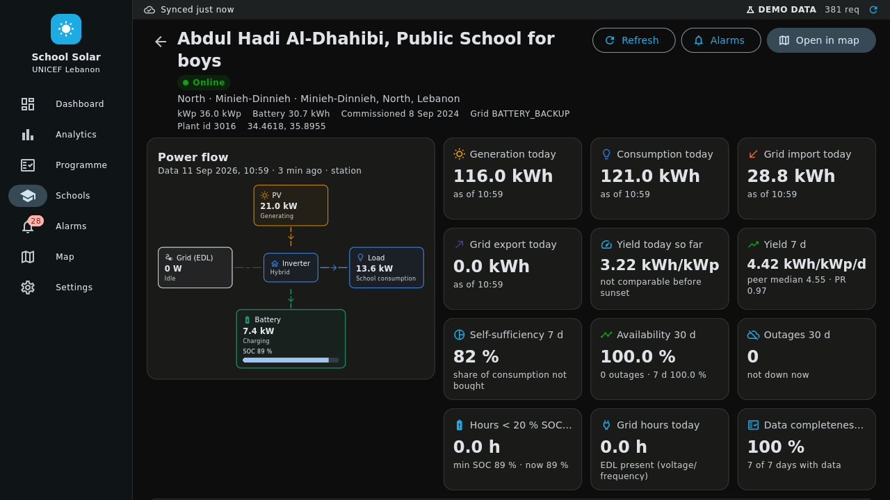

# UNICEF Lebanon — School Solar Monitor

Tablet application (Flutter + SQLite) that mirrors every school solar plant registered in the
UNICEF DeyeCloud account into a local database and renders a real-time, country-wide monitoring
dashboard: plant status, alarms, live power flow, energy history, battery health, availability,
governorate roll-ups, rankings and environmental impact — all readable offline once synced.

* **Source of data**: DeyeCloud Open API v1 (`https://eu1-developer.deyecloud.com/v1.0`), see
  [`docs/API_REFERENCE.md`](docs/API_REFERENCE.md).
* **Architecture**: [`docs/ARCHITECTURE.md`](docs/ARCHITECTURE.md) (sync engine, schema, insights).
* **Screens**: [`docs/UI_SPEC.md`](docs/UI_SPEC.md).

## Features

| Area | What you get |
|------|--------------|
| Landing dashboard | fleet-wide power generation and consumption (now, today, 7 d, 30 d, lifetime), carbon footprint avoided with diesel equivalent, generation-vs-consumption curve, energy balance, carbon by month, fleet health, generation by governorate |
| Programme | solarisation programme dashboard from the MEHE/UNICEF workbooks: public schools vs solarised vs connected vs monitored (overall and per governorate), pipeline, students benefiting, installed kWp, investment and cost per kWp, funding by donor/project/contractor, audited annual loads by category vs expected and measured generation, undersized systems, next candidates, LED share, education indicators, plant ↔ school link status |
| Analytics | schools online/offline/alarm/stale, live PV / load / grid / battery totals, capacity utilisation, today's and 30-day energy, self-sufficiency, availability, CO₂ and diesel avoided, governorate table, attention lists (offline, under-performing, low battery, critical alarms), top/bottom yield rankings, SOC histogram, alarm trends |
| Schools | searchable, filterable, sortable table of every plant with live values, 7-day specific yield vs governorate peers, availability, alarms, last data, linked CERD, internet connectivity and donor; CSV export |
| School detail | live power-flow diagram, today's power curve (yesterday as context), 30-day / 12-month energy, battery SOC history, every inverter/battery reading, alarms, status history, plus the linked MEHE school record (students, ownership, connectivity, solar tracker data, audited loads and equipment inventory vs measured generation, attendance and risk) with a manual link picker |
| Alarms | cloud alarms (DeyeCloud alert list) plus locally derived alarms (plant offline, device alarm state, alert messages, low SOC, over-temperature, PV string fault, no midday generation), acknowledge, filters, MTTR |
| Map | Lebanon map with governorate outlines and status-coloured markers per plant, plus an optional layer of all public schools coloured by solarisation status and connectivity |
| Settings | DeyeCloud credentials (secure storage), demo mode, school dataset (version, counts, re-import, re-link), sync cadence, retention, factors, diagnostics (sync log, DB stats, app log) |

Everything is stored locally in SQLite (`unicef_solar.db`): plant master data, live values,
per-plant power time series, per-device samples, daily/monthly energy, battery statistics, status
transitions, alarms, the sync log, the school dataset (MEHE master list, connectivity, solar tracker,
energy audit, education indicators) and the plant ↔ school links. Retention of raw time series is configurable (default 7 days);
daily/monthly energy and status history are kept indefinitely.

## Getting started

Requirements: Flutter 3.47 / Dart 3.13, Android SDK (API 24+) for tablets, or a Linux/Windows
desktop toolchain for desktop builds.

```bash
flutter pub get
flutter test                 # unit + widget tests (uses an in-memory SQLite and the demo API)
flutter run -d <tablet>      # or: flutter run -d linux
flutter build apk --release  # Android tablet package
```

Notes:
* Windows desktop builds need `sqlite3.dll` next to the executable (or add the
  `sqlite3_flutter_libs` package, which downloads SQLite at build time). Linux uses the system
  `libsqlite3`; Android uses the bundled sqflite plugin.
* If Material icons ever render as boxes after an incremental build, run `flutter clean` first (the
  icon-font subset is regenerated on a clean build) or pass `--no-tree-shake-icons`.
* The CI workflow in `.github/workflows/ci.yml` runs analyzer + tests and uploads a release APK.

## Screenshots (demo mode, Linux desktop build)

| Landing dashboard | Landing dashboard (continued) |
|-------------------|-------------------------------|
|  |  |

| Programme (solarisation coverage) | Programme (funding, audited loads) |
|-----------------------------------|------------------------------------|
|  |  |

| Programme (attention lists, measured vs audited) | Programme (education, links) |
|--------------------------------------------------|------------------------------|
|  |  |

| Analytics | Schools (CERD, internet, donor columns) |
|-----------|-----------------------------------------|
|  |  |

| School detail | School record (MEHE data, audit, education) |
|---------------|---------------------------------------------|
|  |  |

| Alarms | Map with the public-schools layer |
|--------|-----------------------------------|
|  |  |

| Map | Settings |
|-----|----------|
|  |  |

| Governorates and attention lists | School detail: today's curve |
|----------------------------------|------------------------------|
|  |  |

| Dark theme |  |
|------------|--|
|  |  |

All captures (light and dark, every screen scrolled) are in `docs/screenshots/`, generated by
`scripts/screenshots.sh` from the Linux desktop build in demo mode with the clock set to 14:00 Beirut
time. In demo mode the synthetic plants carry the names and coordinates of real solarised
schools, so the programme pages show the real dataset joined with synthetic live data.

### Credentials

The app needs a DeyeCloud **developer application** (App ID + App Secret from
https://developer.deyecloud.com/app) and the DeyeCloud **account** (e-mail + password, and the
**company id** for the UNICEF organisation account). Enter them in *Settings → DeyeCloud account*
and press *Test connection* (it logs in and lists the organisations the account belongs to);
they are stored in the device secure store (Android Keystore) and never in the database or the
repository. The password field accepts either the plain password or its SHA-256 hex digest.
The **App ID** is mandatory for the token call (`/account/token?appId=…`) — it is shown next to
the App Secret in the developer portal's application page.

For kiosk deployments the values can be baked in at build time (they still end up only in secure
storage on first launch):

```bash
flutter build apk --release \
  --dart-define=DEYE_APP_ID=... \
  --dart-define=DEYE_APP_SECRET=... \
  --dart-define=DEYE_EMAIL=... \
  --dart-define=DEYE_PASSWORD_SHA256=... \
  --dart-define=DEYE_COMPANY_ID=... \
  --dart-define=DEYE_REGION=eu
```

> **Do not commit credentials.** If an App Secret or password was ever shared in chat, e-mail or a
> ticket, rotate it in the DeyeCloud developer portal / account settings.

### Demo mode

*Settings → Demo mode* switches the data source to a synthetic fleet of ~60 Lebanese schools with
realistic diurnal PV, school-hours load, EDL outages, batteries, faults and alarm history — useful for
training, screenshots and UI work without network access. Tests use the same generator.

## School dataset (MEHE / UNICEF workbooks)

Five workbooks — the MEHE public school list (1,211 schools), the internet-connectivity roll-out
(534 schools), the UNICEF solar implementation tracker, the energy audit (annual loads and equipment
inventory) and the MEHE education dashboard — are merged by **CERD number** into
`assets/data/schools.json` with:

```bash
pip install openpyxl
python3 scripts/build_school_dataset.py <folder containing the .xlsx files>
```

Bump `version` in the script when the workbooks change; the app re-imports the JSON into SQLite on
the next start. Director names and personal phone numbers are deliberately left out. Plants are
linked to school records automatically after every sync (name similarity with transliteration
folding + coordinates) and can be linked by hand from the school page; the *Programme* tab, the school
profile on each plant page, the list columns and the map layer all read from these tables. Details in
`docs/ARCHITECTURE.md`.

## How synchronisation works (short version)

Every 5 minutes (configurable) the engine: lists plants → lists devices (hourly) → polls all inverters
and batteries in batches of 10 (`/device/latest`) → derives each plant's status and derived alarms →
polls `/station/latest` for every plant (every 15 min) → fetches daily/monthly history once a day →
backfills yesterday's intraday frames nightly → fetches cloud alarms (hourly fleet-wide, every 15 min
for alarming plants) → recomputes 15-minute fleet/governorate aggregates and battery statistics →
runs housekeeping once a day. Per-plant failures never abort a sweep; systemic API failures trip a
circuit breaker with back-off that is visible in the status bar. Details in `docs/ARCHITECTURE.md`.

## Things to verify against the live account

The DeyeCloud developer portal was not reachable from the environment in which this app was
written, so a few items are implemented defensively and should be checked on first connection:

1. **Alert endpoints** — launched Dec 2024; the client probes `/station/alertList`,
   `/station/alert/list`, … and remembers the first that answers. If the portal documents other paths
   or body keys, set them in *Settings → Advanced* or edit `lib/core/api/deye_endpoints.dart`.
   Derived alarms work regardless.
2. **Field names** in `/station/list`, `/station/latest` and `/device/latest` are parsed tolerantly
   (several aliases per field); check *Settings → Diagnostics → app log* after the first sync for
   "skipped"/"no data timestamp" messages and compare with `docs/API_REFERENCE.md`.
3. **Sign conventions** of inverter `TotalGridPower` / `BatteryPower` (assumed positive = import /
   discharge, as on Deye hybrids). The plant-level `/station/latest` values are used preferentially.
4. **Rate limits** are unpublished; the defaults (4 concurrent requests, ≥120 ms apart) can be tuned
   in Settings.

## Repository layout

```
lib/core        models, API client, SQLite DAOs, sync engine, insights, school dataset + linker, demo data, settings
lib/features    overview, dashboard (analytics), programme, stations, alarms, map, settings, shared widgets/charts, shell
assets/geo      Lebanon governorate/district polygons (geoBoundaries, CC BY 4.0)
assets/data     schools.json — merged MEHE/UNICEF school dataset (no personal data)
scripts         build_school_dataset.py (xlsx → JSON), screenshots.sh
docs            API reference, architecture, UI specification
test            core unit tests (incl. dataset/linker/insights), end-to-end sync test, widget tests
```

## Licence / attribution

Boundary data © [geoBoundaries](https://www.geoboundaries.org) (CC BY 4.0). Map tiles ©
OpenStreetMap contributors. Deye and DeyeCloud are trademarks of Ningbo Deye Inverter Technology.
